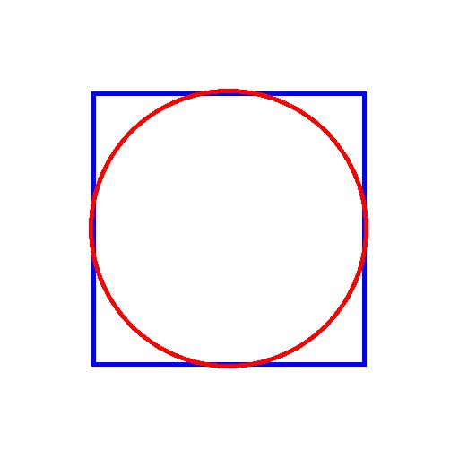
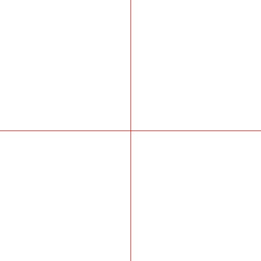

# Optical Illusions, Warm-Ups (Python + dudraw)

Four short warm-ups to get comfortable with `dudraw`, a simple drawing
library, and with using `for` loops to draw things. Each one gives you
a file that's almost right. It's either missing something or has a
small bug. Your job is to fix it.

## Learning Goals

- Get comfortable with `dudraw`, a coordinate-based drawing library.
- Use a loop counter to control something about what gets drawn each
  time through the loop: a position, a size, or a color.
- Practice reading code someone else wrote and figuring out what's
  wrong with it, not just writing code from scratch.

## Getting the Starter Files

Open a terminal in VSCodium (Terminal menu → New Terminal) and run
these commands one at a time, checking the output of each before
running the next.

```
pwd
```
Make sure this shows your workspace folder (something like
`.../cs50-workspace`). If it doesn't, `cd` there first. Everything
below assumes you're starting in the right place.

```
curl -L -O https://raw.githubusercontent.com/mrsharp-milken/illusions-part1/main/illusions-part1.zip
```
This downloads a zip file into your current folder.

```
unzip illusions-part1.zip
```
This unpacks it into a new folder called `illusions-part1`.

```
mv illusions-part1 illusions
```
This renames that folder to `illusions`. `mv` means both "move" and
"rename" in the terminal, same command either way.

```
rm illusions-part1.zip
```
Deletes the zip now that you don't need it anymore. Unlike dragging a
file to the Trash, this delete is permanent.

```
cd illusions
```
Moves you into the folder you just created.

```
python3 test_dudraw.py
```
A window should pop up with a red circle in the middle. Close it when
you're done looking. If this works, you're ready to start the
warm-ups below. If it doesn't, see **Installing dudraw** below.

<details>
<summary><strong>Installing dudraw</strong> (click to expand)</summary>

`dudraw` is a small drawing library built on top of
[pygame](https://www.pygame.org/).

1. **Install it:**

   ```
   pip3 install dudraw
   ```

2. **Verify the install:**

   ```
   python3 -c "import dudraw; print('dudraw is ready')"
   ```

   If that prints `dudraw is ready` with no errors, you're set. Go
   back up and run `test_dudraw.py`.

**Troubleshooting:**

- **`ModuleNotFoundError: No module named 'dudraw'`**: you likely
  installed it for a different Python than the one you're running.
  Double check with `python3 -m pip install dudraw` so pip and python
  definitely match.
- **Window flickers open and immediately closes**: make sure the
  last line of your program is `dudraw.show(float("inf"))`, not
  `dudraw.show(0)`. `0` means "wait 0 milliseconds," not "wait
  forever." It renders once and returns right away, so the window
  closes the instant your script ends.
- **No window appears at all**: make sure you're calling
  `dudraw.show(...)` at all. Without it, dudraw never actually
  renders anything to the screen.

</details>

<details>
<summary><strong>dudraw quick reference</strong> (click to expand)</summary>

By default, the drawing canvas is a unit square: `x` and `y` both
range from `0.0` (left/bottom) to `1.0` (right/top), no matter what
pixel size you set with `set_canvas_size`.

| Function | What it does |
|---|---|
| `dudraw.set_canvas_size(w, h)` | Set the window size in pixels (call once, at the top of `main`). |
| `dudraw.clear(color)` | Fill the whole canvas with a color. |
| `dudraw.set_pen_color(color)` | Set the color used by shapes drawn after this call, e.g. `dudraw.RED`. |
| `dudraw.set_pen_color_rgb(r, g, b)` | Same, but as three `0`-`255` numbers instead of a named color. |
| `dudraw.set_pen_width(w)` | Set line thickness (as a fraction of canvas size, e.g. `0.01`). |
| `dudraw.line(x0, y0, x1, y1)` | Draw a line segment between two points. |
| `dudraw.filled_circle(x, y, r)` / `dudraw.circle(x, y, r)` | Filled or outlined circle, centered at `(x, y)`, radius `r`. |
| `dudraw.filled_square(x, y, r)` / `dudraw.square(x, y, r)` | Filled or outlined square, centered at `(x, y)`, with "radius" `r` (half the side length). |
| `dudraw.filled_rectangle(x, y, half_w, half_h)` | Filled rectangle centered at `(x, y)`. The last two args are half-width/height. |
| `dudraw.show(msec)` | Render everything drawn so far, then wait `msec` milliseconds before returning. Use `dudraw.show(float("inf"))` to leave the window open until closed by hand. |

Named colors include `dudraw.BLACK`, `dudraw.WHITE`, `dudraw.RED`,
`dudraw.GREEN`, `dudraw.BLUE`, `dudraw.YELLOW`, `dudraw.ORANGE`,
`dudraw.MAGENTA`, `dudraw.CYAN`, `dudraw.GRAY`, among others.

</details>

## A Useful Idea for the Loop Warm-Ups

In warm-ups 3 and 4 below, a loop's counter (`i`, going `0, 1, 2, 3...`)
needs to control something about what gets drawn, a position or a
color. The pattern is always the same: turn `i` into the thing you
actually want with a small formula.

Before writing or fixing any drawing code, print what your formula
produces:

```python
for i in range(6):
    print(i, i * 35)
```

Check the numbers before you check the picture. If the numbers aren't
doing what you expect, the drawing won't either, and it's a lot easier
to spot a bad formula in a column of numbers than in a window full of
circles.

## Warm-Ups

Do these in order. The later ones build on ideas from the earlier
ones. For each one, run the file first to see what's already there
and what's wrong with it, before you start editing.

### Warm-Up 1: Circle and Square (`warmup1_circle_square.py`)



`draw_circle_and_square()` draws a square with a circle inside it, but
the circle is too big: it pokes out past the square's edges instead
of touching the sides exactly. Find the line that sets the circle's
radius, and fix it so the circle is inscribed exactly inside the
square, no matter what `half_side` is set to.

### Warm-Up 2: Crosshairs (`warmup2_crosshairs.py`)



`draw_crosshairs()` should draw a red "+" spanning the whole canvas,
but right now it only draws half of a horizontal line. Two things
need fixing: extend that line so it spans the full canvas (not just
center to the right edge), and add the missing vertical line.

### Warm-Up 3: Random Colored Rectangles (`warmup3_random_rectangles.py`)

`draw_random_rectangles()` is supposed to draw a row of vertical
rectangles, each a different random color, spaced evenly across the
canvas. Right now, all the rectangles come out the same color and
badly overlap. Both bugs are the same kind of mistake: something that
should happen fresh every time through the loop is instead only
happening once, outside of it.

- `new_random_color()` is provided for you (don't change it), but
  check where it's being called.
- Once colors are fixed, check how `x` is computed for rectangle `i`.
  It should land in a different spot each time.

Once both are fixed, try changing `NUM_RECTANGLES` and `SPACING` and
re-running. Your loop should keep working no matter what those are
set to.

### Warm-Up 4: Darkening Concentric Circles (`warmup4_concentric_circles.py`)

`draw_concentric_circles()` currently draws 4 circles, all typed out
by hand, that get smaller and darker toward the center. Rewrite it as
a loop that draws `NUM_CIRCLES` circles (currently set to 6) instead.

Two things change together as `i` counts up: the radius shrinks, and
the color gets darker. The 4 circles already there spell out the
radius math (`MAX_RADIUS - _ * RING_STEP`) across the 4 calls, and the
brightness too (dropping by 35 each time). Your job is to turn that
pattern into one loop, using `i` in place of the `0`, `1`, `2`, `3`
that are hardcoded right now.

**Tip:** if it's hard to tell which circle is covering which, add
`dudraw.show(200)` as the last line inside your loop while you're
debugging. It'll pause and redraw after each circle so you can watch
them get layered on top of each other. Remove it (or move it back
outside the loop, at the end of `main`) once you're happy with the
result.

## How to Run

```
python3 warmup1_circle_square.py
```

(same idea for the other three files)

## How to Test

There's no automated "correct answer" here. Testing is visual:

- Run each file and compare it to the description of what it should
  look like.
- For warm-ups 3 and 4, change a constant at the top of the file
  (`NUM_RECTANGLES`, `NUM_CIRCLES`, etc.) and re-run, to make sure your
  loop-based fix generalizes instead of only working for the exact
  numbers it started with.
